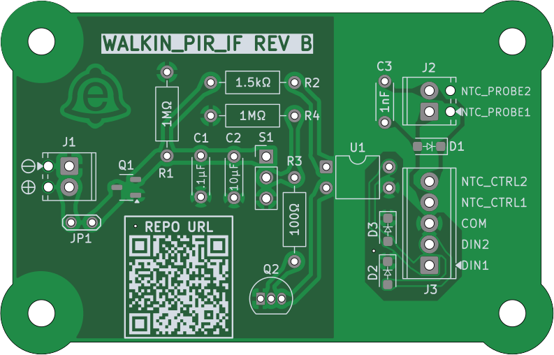
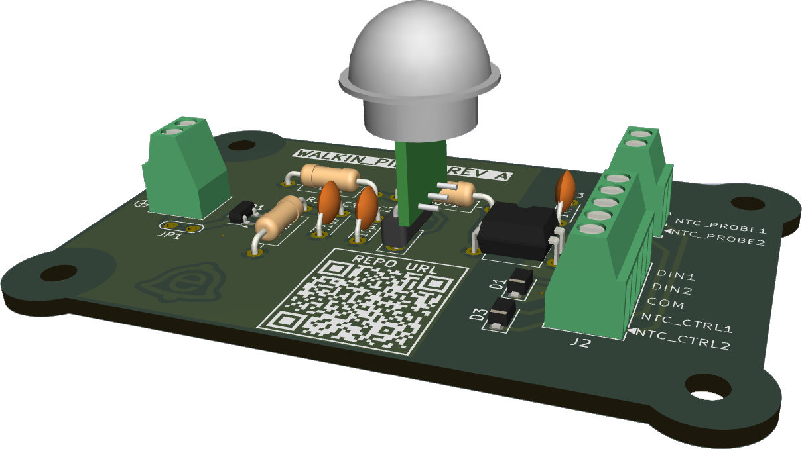

# Battery-Powered PIR Motion Interface (Isolated Dry Contact)

## Overview
Battery-powered PIR interface designed to trigger **motion-activated overhead lighting** via an **isolated dry input** on an **XWA11V industrial controller**. Intended for installation in a **walk-in cooler** where running mains power to the sensor is undesirable.

The board detects motion using an **AM312 PIR** and signals the controller by closing a **dry contact (DIN ↔ COM)** through a **PhotoMOS relay**. It also provides a **pass-through connection for an external NTC temperature probe**, allowing temperature sensing to share the same cable run.

All lighting logic and power switching are handled by the controller; this board functions as a low-power, robust peripheral.

---

## Design Summary
- **Power:** 3×AA battery (targeting multi-month to ~1 year life)
- **Isolation:** PhotoMOS relay provides a true dry contact
- **Protection:**
  - Reverse polarity protection on battery input
  - TVS diodes on all field wiring (DIN, COM, NTC probe)
- **Environment:** Cold (~35–40°F), ~6 ft cable runs
- **Assembly:** Hand-solderable THT + simple SMD parts

---

## Design Rationale
- Battery power avoids mains wiring near the sensor
- PhotoMOS isolation prevents ground loops with industrial controls
- TVS protection improves robustness for long, exposed wiring
- Conservative, low-power design prioritizes reliability over complexity

---

## Hardware Documentation

All design, assembly, and fabrication artifacts are published here:

➡️ [WALKIN_PIR_IF Documentation (MkDocs)](https://thundersloth.github.io/walkin-pir-interface/)

---

## Hardware Status

**Rev B sent to fabrication ✅**  
Simplified prototype validated (video below).

- **Rev A:** PIR output sags under direct PhotoMOS LED drive → unreliable switching.
- **Rev B:** Added NPN low-side driver + LED current-limit resistor to isolate PIR output from load.

[https://github.com/user-attachments/assets/d97296ae-1a20-4d2e-b4a4-3fdf33289da8](https://github.com/user-attachments/assets/c07f9941-2b6e-4c99-ae80-a9b624c08050)

