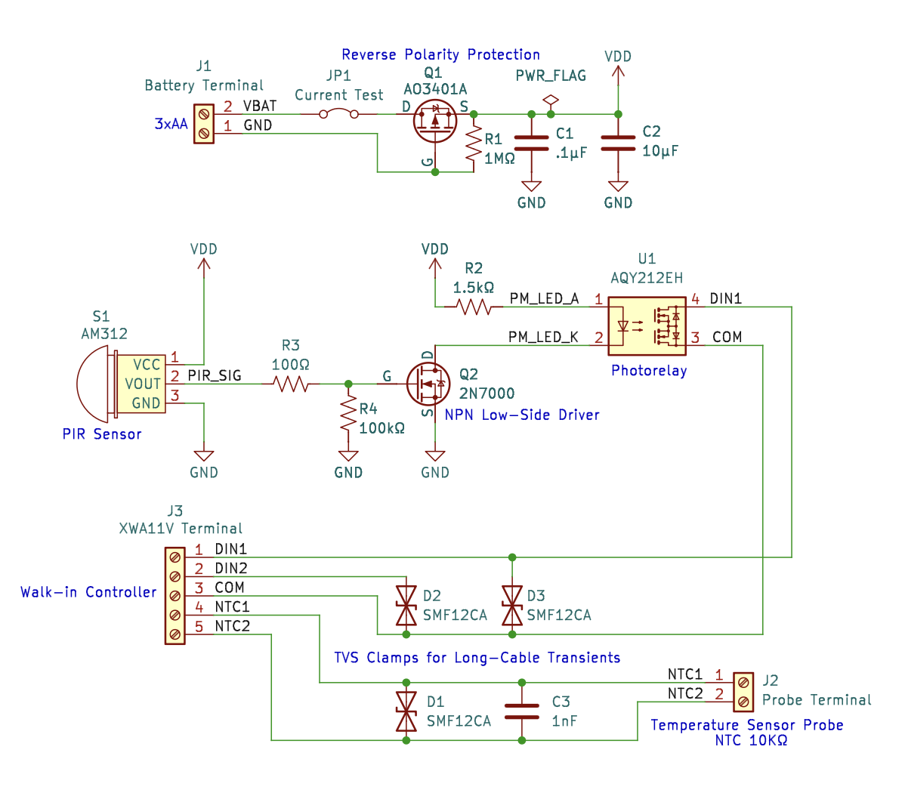
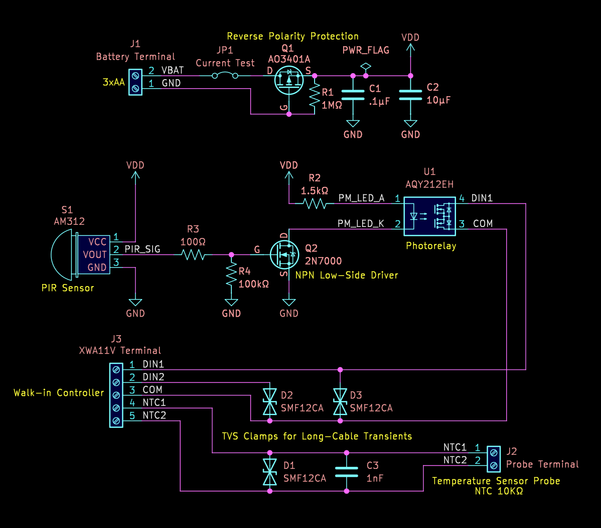

# WALKIN_PIR_IF — Hardware Documentation

Battery-powered PIR motion interface providing an isolated dry contact output for an industrial controller.

  
  

This site hosts the complete set of design, assembly, and fabrication artifacts generated from the KiCad project via KiBot.

---

## ℹ️ Project

- **GitHub Repository** [[view]](https://github.com/ThunderSloth/walkin-pir-interface)

---

## 📐 Design

- **Schematic (PDF)** [[view]](artifacts/docs/schematic/WALKIN_PIR_IF-schematic.pdf)
- **PCB Render — Top (2D)** [[view]](artifacts/docs/renders/WALKIN_PIR_IF-top.png)
- **PCB Render — Bottom (2D)** [[view]](artifacts/docs/renders/WALKIN_PIR_IF-bottom.png)

---

## 🔧 Assembly

- **Interactive BOM (iBOM)** [[view]](artifacts/docs/ibom/WALKIN_PIR_IF-ibom.html)
- **Bill of Materials (CSV)** [[view]](artifacts/assembly/WALKIN_PIR_IF-bom.csv.html) [[download]](artifacts/assembly/WALKIN_PIR_IF-bom.csv)
- **Pick & Place — Top Side (CSV)** [[view]](artifacts/assembly/WALKIN_PIR_IF-pickplace-top_pos.csv.html) [[download]](artifacts/assembly/WALKIN_PIR_IF-pickplace-top_pos.csv)
- **Assembly Drawing (PDF)** [[view]](artifacts/docs/assembly/WALKIN_PIR_IF-assembly-top.pdf)

---

## ⚙️ Fabrication

- **Fabrication Drawing (PDF)** [[view]](artifacts/docs/fab/WALKIN_PIR_IF-fab-drawing.pdf)
- **Gerbers & Drill Files (ZIP)** [[download]](artifacts/fab/WALKIN_PIR_IF_fab.zip)

---

## 🧊 Mechanical

- **3D STEP Model** [[download]](artifacts/mcad/WALKIN_PIR_IF-3D.step)
